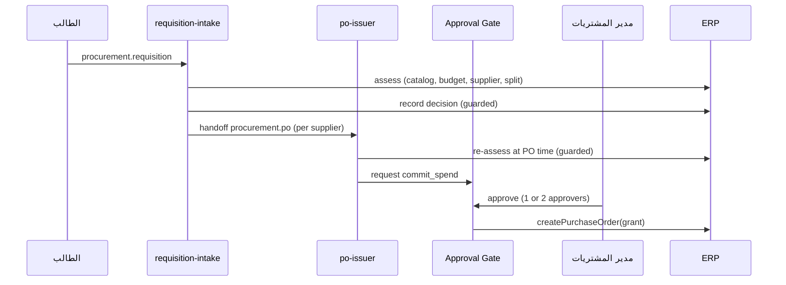

# مجال المشتريات: النموذج المرجعي

أول مجال مبني بالكامل. يُكرَّر قالبه في المالية والامتثال.

## الوكلاء

| الوكيل | المسمى | مؤشر الأداء | صلاحية الإلزام المالي |
|--------|--------|-------------|------------------------|
| [`requisition-intake`](requisition-intake/README.md) | Requisition Intake Specialist | دقة القرار من أول مرة ≥ 95% | لا |
| [`po-issuer`](po-issuer/README.md) | Purchase Order Specialist | أوامر خالية من العيوب ≥ 99% | نعم، بموافقة بشرية فقط |

## التدفق

## المشترك بين الوكيلين: `shared/`

| الملف | المحتوى |
|-------|---------|
| `policy.ts` | قيم السياسة: حد العروض الثلاثة 10 آلاف دولار، ونافذة التقسيم 14 يومًا، وحد التقسيم 50 ألف دولار |
| `assessment.ts` | التقييم الحتمي، المصدر الوحيد لقواعد القرار. تستخدمه الأدوات والحواجز والسياسة المرجعية |
| `tools/` | أدوات القراءة المشتركة |
| `guardrails/same-task-scope.ts` | يحصر الإجراءات في طلب المهمة ومورّدها |
| `eval-fixtures.ts` | تجهيز بيانات السيناريوهات |

## نقاط القوة في التصميم

1. **الأسعار من الكتالوج دائمًا.** أداة إصدار الأمر تأخذ معرّفات فقط، فلا يمكن للنموذج أو لعرض سعر خبيث أن يحدد السعر أو الكمية.
2. **التقييم يُعاد لحظة الإصدار.** ما كان صحيحًا عند الفرز قد لا يبقى صحيحًا، كأن تُستهلك الميزانية أو يصدر أمر سابق.
3. **التقييم يُعاد لحظة التنفيذ بعد الموافقة.** إذا ارتفع السعر بعد الموافقة، يرفض الـ connector التنفيذ لأن المبلغ تجاوز المبلغ الموافق عليه.
4. **كشف التقسيم.** طلبات متتالية لنفس المورد من نفس الطالب خلال 14 يومًا، تتجاوز معًا حد الموافقة المزدوجة.

## ما هو مستقبلي في هذا المجال

- **وكيل التوريد (`sourcing-agent`):** يجمع 3 عروض أسعار للأصناف غير المتعاقد عليها. يحتاج تكاملًا مع بوابات الموردين، وحاليًا تُحال هذه الحالات لإنسان.
- **إرسال الأمر للمورد عبر EDI أو بوابة المورد:** الآن يُعد صادرًا بمجرد إنشائه في ERP.
- **إشعار الطالب عبر البريد أو Teams:** الآن الإشعار في ملخص المهمة وفي ملاحظة ERP.
