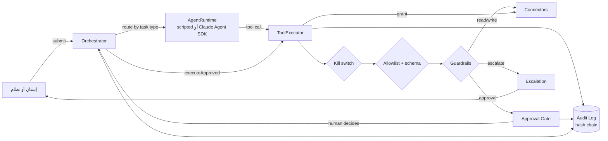

# البنية المشتركة (platform)

كل الوكلاء يعملون فوق هذه البنية، ولا يملك أي وكيل طريقًا إلى الأنظمة الخارجية إلا عبرها.

## المسار الكامل لمهمة



## المكوّنات

| المكوّن | الملف | المسؤولية | الضمانة المنفّذة في الكود |
|---------|-------|-----------|---------------------------|
| Orchestrator | `orchestrator/orchestrator.ts` | يوجّه المهام، ويتتبع حالتها، وينفّذ الإحالات، ويستأنف بعد القرار البشري | آلة حالات صارمة، وidempotency، وإحالات مقيّدة بـ `canHandoffTo`، والحالة تُشتق من الوقائع لا من ادعاء الوكيل |
| Approval Gate | `approval/approval-gate.ts` | موافقة بشرية لكل إجراء لا رجعة فيه | فصل الصلاحيات (SoD)، والأدوار، وموافقة مزدوجة فوق 50 ألف دولار، وTTL، وتفويض يُستخدم مرة واحدة ومربوط بنوع الإجراء والمبلغ |
| Audit Log | `audit/audit-log.ts` | سجل لكل قرار وإجراء | سلسلة hash، وtriggers تمنع UPDATE وDELETE، و`verify()` عند الإقلاع وفي كل eval |
| Memory | `memory/memory-store.ts` | ذاكرة task وagent وshared | قائمة namespaces مسموحة، وحد أقصى للاحتفاظ، وحجب تلقائي للبيانات الشخصية، ومحو ذاكرة المهمة عند انتهائها، و`eraseSubject` |
| Connectors | `connectors/` | واجهات ERP والدفع والبريد والعقوبات (mocks الآن) | الإجراء الذي لا رجعة فيه يستهلك `ApprovalGrant`، والدفع لا يتم إلا لـ IBAN المسجل في السجل الرئيسي |
| ToolExecutor | `tools/executor.ts` | نقطة الإنفاذ الوحيدة لكل أداة | الترتيب الثابت: إيقاف طارئ ← حد استدعاءات ← allowlist ← schema صارم ← حواجز ← صلاحية ← audit |
| Escalation | `escalation/` | الإحالة إلى إنسان | أسباب من قائمة مغلقة، وSLA حسب الخطورة، وعدم التكرار. التفاصيل في [`escalation/README.md`](escalation/README.md) |
| Untrusted content | `security/` | المحتوى الخارجي بيانات لا تعليمات | تغليف بوسم عشوائي، وكشف أنماط بالعربية والإنجليزية، و`injectionGuard` يصعّد الإجراءات التي لا رجعة فيها |
| Runtimes | `runtime/` | تشغيل الوكيل | `ScriptedRuntime` حتمي للاختبار، و`ClaudeAgentRuntime` يعطّل كل أدوات Claude Code المدمجة ويمر بـ ToolExecutor نفسه |
| Eval harness | `eval/` | اختبار كل الوكلاء بأمر واحد | منصة معزولة لكل سيناريو، ومعايير على الوقائع المسجلة، وفحص سلامة audit إلزامي |
| Kill switch | `core/kill-switch.ts` | إيقاف طارئ فوري | يُفحص قبل كل أداة وكل مهمة، ويُفعَّل بمتغير بيئة أو ملف علَم |

## مبادئ التصميم

1. **الأمان في الكود لا في البروموت.** البروموت يوجّه النموذج، أما المنع فمكانه ToolExecutor والـ connectors وقاعدة البيانات. لذلك تختبر evals الحتمية المسار نفسه الذي يمر به Claude في الوضع الحي.
2. **دفاع متعدد الطبقات.** الدفع مثلًا يجب أن يجتاز كل هذه الطبقات بالترتيب:
   1. أن تكون الأداة في allowlist الوكيل.
   2. أن تجتاز مدخلاتها schema صارمًا.
   3. أن تجتاز الحواجز (guardrails).
   4. أن يوافق عليها إنسان بدور مسموح، وليس هو من أنشأ المهمة.
   5. أن تكون الحمولة مطابقة للـ hash الذي وافق عليه.
   6. أن يُستهلك التفويض مرة واحدة.
   7. أن يكون المبلغ ضمن المبلغ الموافق عليه.
   8. أن يكون الـ IBAN مطابقًا للسجل الرئيسي للمورد.
3. **الحالة من الوقائع.** إن ادعى الوكيل أنه طلب موافقة ولا يوجد طلب مسجل، فهذا تناقض يُصعَّد، ولا يُصدَّق الوكيل.
4. **الفشل مغلق (fail-closed).** العملة غير المعروفة تخضع لأشد حد موافقة، والمخرج غير الصالح فشل، والتفويض لا يُستهلك على دفعة مرفوضة.

## الاستخدام

```ts
import { createPlatform } from "./platform/index.ts";
const p = createPlatform().register(myAgent);
const task = p.orchestrator.submit({ type: "procurement.requisition", input, originator: "u-requester" });
await p.orchestrator.drain();
await p.orchestrator.decideApproval(approvalId, "u-proc-mgr", "approve", "within budget");
```

أصغر مثال كامل لوكيل موجود في [`eval/selfcheck/agent.ts`](eval/selfcheck/agent.ts).
